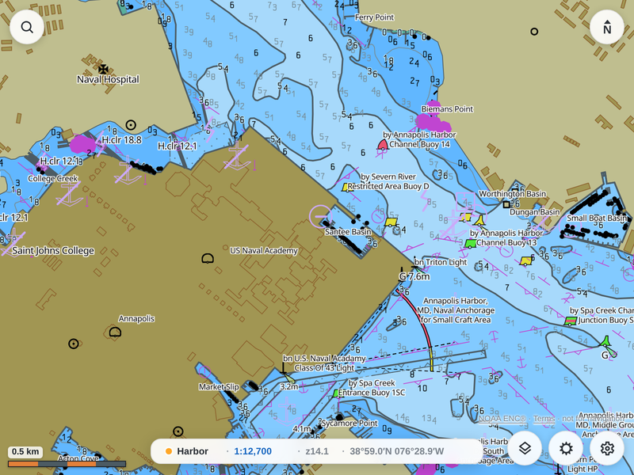
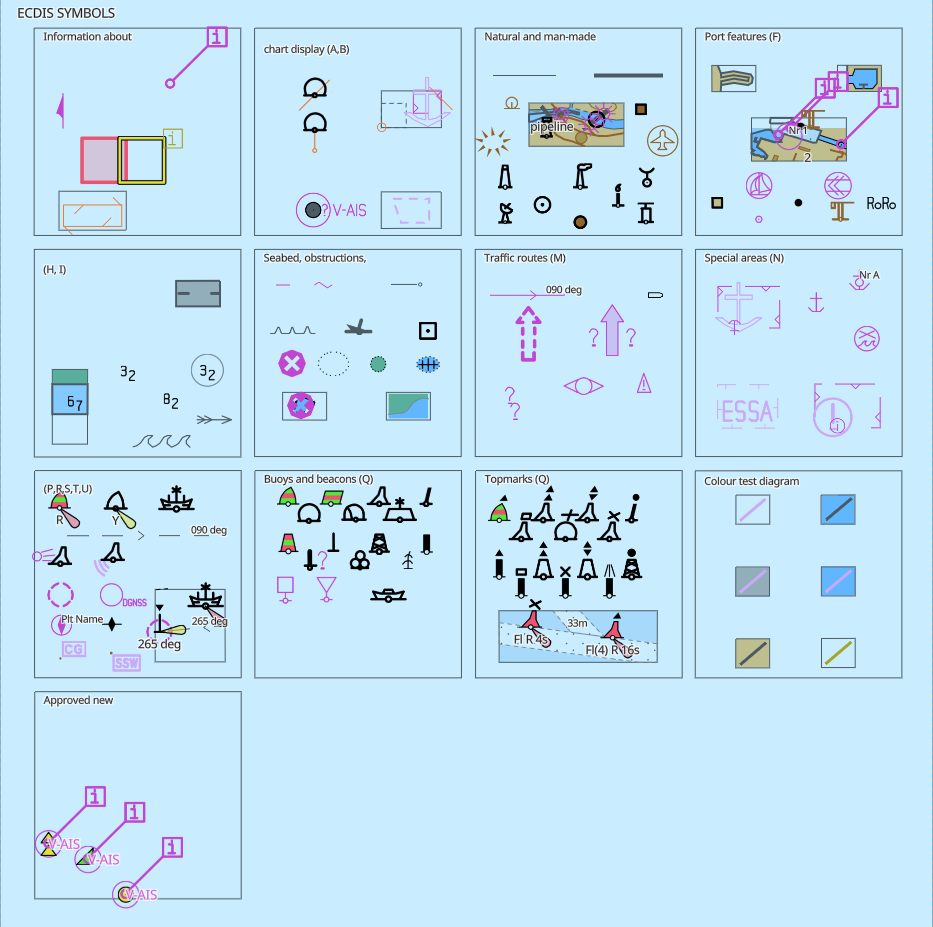

<h1 align="center">chartplotter</h1>

<p align="center">
  <b>⚓ A marine chart plotter, in Go.</b><br>
  Generate offline vector-tile archives from NOAA S-57 ENC cells and render them in the browser.
</p>

<p align="center">
  <a href="https://github.com/beetlebugorg/chartplotter/actions/workflows/ci.yml"></a>
  <a href="https://github.com/beetlebugorg/chartplotter/releases"></a>
  <a href="https://goreportcard.com/report/github.com/beetlebugorg/chartplotter"></a>
  <a href="LICENSE"></a>
</p>

<p align="center">
  ▶ <b><a href="https://beetlebugorg.github.io/chartplotter/demo/">Try the live demo</a></b>
  &nbsp;·&nbsp;
  📚 <b><a href="https://beetlebugorg.github.io/chartplotter/">Read the docs →</a></b>
</p>

<p align="center">
  <a href="https://beetlebugorg.github.io/chartplotter/demo/" title="Open the live, interactive chart viewer">
    
  </a>
  <br><sub>▶ <b><a href="https://beetlebugorg.github.io/chartplotter/demo/">Open the live, interactive demo</a></b> — official NOAA charts of Annapolis, rendered in your browser. No install, no server.</sub>
</p>

---

> [!WARNING]
> **Not for navigation.** This project is coded almost entirely with AI (Claude).
> It is an experiment in building a large, complex specification (IHO S-101) with
> AI, and a personal learning tool — not a certified or tested product. Do not
> rely on it for real-world navigation. See
> [Known limitations](https://beetlebugorg.github.io/chartplotter/limitations) for
> what the chart rendering does not yet do.

---

chartplotter turns official NOAA nautical charts into fast map tiles you can view
in a web browser, online or fully offline.

It reads **S-57** electronic navigational chart (ENC) cells and draws them with the
**S-101 Portrayal Catalogue**, the modern IHO standard for how charts look. It
writes the result to a single **PMTiles** archive of **Mapbox Vector Tiles**. A small
`<chart-plotter>` web component, built on
[MapLibre GL JS](https://maplibre.org/maplibre-gl-js/docs/), draws the chart.

In short: the heavy lifting happens once, up front. chartplotter reads the raw NOAA
charts and renders every feature — its colors, symbols, and lines — into map tiles,
saved as a single file on your machine. After that the browser only *displays* those
tiles — panning, zooming, switching palettes — and never touches the raw charts again.

## 🎯 Goal

Implement the IHO chart standards — **S-57** (ENC data), **S-101** portrayal (the
successor to S-52), and the wider **S-100 / S-102** family — in **pure Go**, with
**minimal dependencies and no CGO**, so the whole thing **cross-compiles to a single
static binary** for any platform with `GOOS`/`GOARCH` and nothing else to install.

## ✨ Features

- **A complete chart pipeline.** chartplotter does every step: ISO 8211 decode, the
  S-57 feature model, S-101 portrayal, web-Mercator tiling, vector-tile encode, and a
  streaming PMTiles writer.
- **Works offline.** Generate one `.pmtiles` archive for a region, then serve or ship
  it. You do not need a tile server to view it.
- **Adjust the chart live.** Switch Day, Dusk, and Night palettes and toggle mariner
  settings — depth shading, soundings, contours, safety-depth danger highlighting — and
  the map restyles at once. Colors are stored as S-101 names and settings ride along as
  tile attributes, so the viewer applies your changes without regenerating the tiles.
- **Ships as one binary.** The S-101 catalogue *and* the web frontend build into the
  program. A self-contained `chartplotter serve` needs no files on disk — you supply
  only the ENC cells.
- **Runs a server.** The built-in HTTP server downloads NOAA cells, generates tiles in
  the background, and serves the frontend with byte-range support.
- **Live position and AIS (early).** Point a **NMEA 0183** feed at the server (over
  TCP) and it shows your **own ship** and **basic AIS targets** on the chart. A
  built-in `simulate` command generates traffic for testing.
- **Draws the whole symbol set.** It renders the complete S-52 Presentation Library
  **ECDIS "Chart 1"** reference sheet — every symbol, line style, area fill, and
  colour — drawn by the same pipeline that bakes real NOAA charts and diffed against
  the spec's own plots. [See the rendered sheet →](https://beetlebugorg.github.io/chartplotter/chart1)

<p align="center">
  <a href="https://beetlebugorg.github.io/chartplotter/chart1" title="How chartplotter renders the S-52 ECDIS Chart 1 symbol sheet">
    
  </a>
  <br><sub>The S-52 PresLib <b>ECDIS Chart 1</b> symbol sheet, rendered by chartplotter — <code>make preslib-chart1</code>.</sub>
</p>

## 🧩 Beyond the chart

The chart is the foundation, not the whole app. The frontend is built from a
`<chart-plotter>` base plus small **plugins** (own-ship and AIS already work this
way), and the goal is a stable **plugin API** so you can build other things on top
of the chart — **instrument gauges**, custom overlays, routes, and more — without
forking the core. NMEA 0183 own-ship and AIS are the first slice of that; expect
the surface to grow and change.

## 📦 Install

### Pre-built binaries

Download an archive for your platform from the
[**Releases**](https://github.com/beetlebugorg/chartplotter/releases) page, extract it,
and put `chartplotter` on your `PATH`. Each platform ships two builds:

- **`…_s101`** — self-contained: embeds the S-101 catalogue, runs with no extra
  files. (That catalogue is IHO material; see
  [THIRD-PARTY-NOTICES.md](THIRD-PARTY-NOTICES.md).)
- **plain** — needs `--s101 <PortrayalCatalog dir>` at runtime, pointing at your
  own copy of the catalogue.

### With go install

Requires **Go 1.26+**.

```sh
go install github.com/beetlebugorg/chartplotter/cmd/chartplotter@latest
```

### From source

```sh
git clone https://github.com/beetlebugorg/chartplotter.git
cd chartplotter
make build          # -> bin/chartplotter (embeds the catalogue if it is available)
bin/chartplotter version
```

## 🚀 Get started

The frontend is built into the binary, so one file is all you need. Start the server
and open the viewer:

```sh
chartplotter serve
# open http://127.0.0.1:8080 → pick a region → it downloads and builds tiles → the chart appears
```

The server writes everything it generates to your cache directory
(`~/.cache/chartplotter`), never into the binary's assets.

You can also build a standalone archive yourself with the `bake` command:

```sh
# Generate one archive from cells, a directory, or a NOAA ENC zip.
chartplotter bake -o charts.pmtiles US4MD81M.000

# Generate one archive per navigational band (best-available display).
chartplotter bake --bands -o charts.pmtiles US5MD_ENCs.zip
```

To develop the frontend, serve the assets from disk instead of the embedded bundle:

```sh
chartplotter serve --assets web
```

## ⛶ Commands

| Command | What it does |
| --- | --- |
| `version` | Print the version and whether the S-101 catalogue is embedded. |
| `emit-assets DIR` | Write the S-101 client assets (color tables, sprites, line styles, patterns) to a directory. |
| `catalog-json IN.xml OUT.json` | Distil NOAA `ENCProdCat.xml` into a compact `catalog.json`. |
| `bake -o OUT.pmtiles IN…` | Generate a PMTiles archive from S-57 cells, directories, or NOAA ENC zips. |
| `serve [--host] [--port] [--assets DIR]` | Serve the web frontend, the baking API, and the NOAA cell proxy. |
| `simulate` | Run an NMEA 0183 traffic generator over TCP (own-ship + AIS targets) for testing. |

Run `chartplotter <command> --help` for the full flags.

## 🧭 How it works

```
S-57 ENC cell (.000)
   │  ISO 8211 decode             pkg/iso8211
   ▼
S-57 feature + geometry model     pkg/s57
   │  S-101 portrayal             pkg/s100, internal/engine/s101
   ▼
Primitive drawing list (lat/lon)  internal/engine/portrayal
   │  project + clip              internal/engine/tile
   ▼
Mapbox Vector Tiles               internal/engine/mvt
   │  dedup + streaming write     internal/engine/pmtiles
   ▼
charts.pmtiles  ───────────────▶  <chart-plotter> / MapLibre GL JS  (web/)
```

Read the [**Architecture**](https://beetlebugorg.github.io/chartplotter/architecture)
docs for the full pipeline, and the
[**Tile Schema**](https://beetlebugorg.github.io/chartplotter/tile-schema) for the
layer and field contract the frontend depends on.

## 🛠️ Development

```sh
make build      # build bin/chartplotter
make test       # go test ./...
make vet        # go vet ./...
make fmt        # gofmt -w .
make serve      # build + serve web/ on :8080
```

CI runs `gofmt`, `go vet`, `go test`, and `go build` on every push. When you push a
`v*` tag, [GoReleaser](https://goreleaser.com/) cuts a release with binaries for Linux,
macOS, and Windows on amd64 and arm64.

## 📚 Documentation

Full docs live at
**[beetlebugorg.github.io/chartplotter](https://beetlebugorg.github.io/chartplotter/)**:
install, the CLI reference, the chart pipeline, and the vector-tile schema.

## 📄 License

chartplotter's own code is [MIT](LICENSE) © Jeremy Collins.

It bundles third-party software and data under their own licenses — all Go
dependencies are permissive (MIT / BSD-3-Clause), plus MapLibre GL JS (BSD),
Noto Sans (OFL), OpenBridge icons (CC BY 4.0), and a GSHHG coastline basemap
(LGPL). NOAA ENC charts are U.S. public domain and **not for navigation**.

The **IHO S-101 Portrayal & Feature Catalogue** is © IHO and is *not* included in
this repository; a draft copy is embedded only in opt-in `_s101` builds, and its
redistribution terms are still to be confirmed. See
[**THIRD-PARTY-NOTICES.md**](THIRD-PARTY-NOTICES.md) for the full inventory.
